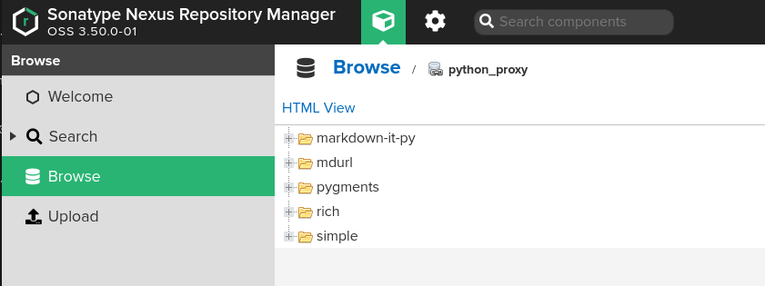
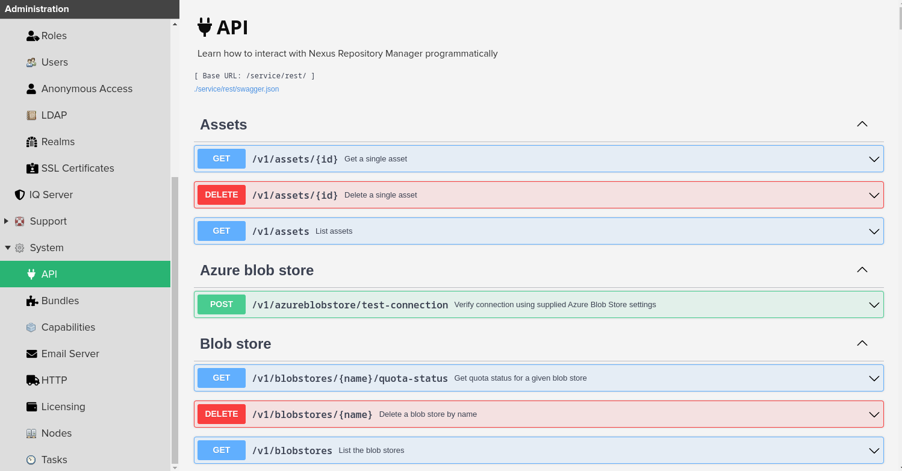

# Provisioning Nexus Sonatype OSS on an Orange PI 5 with Ansible


Nexus 3 OSS is an [Open Source](https://github.com/sonatype/nexus-public) [artifact repository manager](https://www.sonatype.com/products/repository-oss) with the ability to handle multiple formats like container images, Python PIP, Java jar and many others.

Why have an on-premise artifact manager? There are many reasons for it:

* Use your private infrastructure: You may have proprietary code that needs to be safeguarded.
* Faster artifact download speeds: If you constantly download the same artifacts over the Internet you can cache them on a central location, for the benefit of your multiple users across multiple servers by caching them.
* Control what artifacts make it to your build chain: Centralize the location of the artifacts, ensure they are approved for usage and also confirm than they do not contain malicious code.
* Segregate who can have access to your artifacts: You may have more strict requirements on who can access some artifacts within your own organization.

In this article I will show you how you can download, install and configure the OSS version of Nexus 3 using an 
Ansible playbook. Nexus 3 will run on an [Orange PI 5 computer with 8 GB or RAM](http://www.orangepi.org/html/hardWare/computerAndMicrocontrollers/details/Orange-Pi-5.html), but this provisioning can be done on any machine with the [minimum requirements](https://help.sonatype.com/repomanager3/product-information/sonatype-nexus-repository-system-requirements). 
Part of the setup will consist of setting a proxy for [PyPI.org](https://pypi.org), for the machines listed on my [inventory](ansible/inventories/home/hosts.yaml) file.

## What you need to run the code from this tutorial

1. An Internet connection to download the [source code](https://github.com/josevnz/Nexus3OnOrangePI) for the Ansible playbook, Nexus and PIP modules
2. Two or more Linux machines (I used [Debian](https://raspi.debian.net/), [Armbian](https://www.armbian.com/orangepi-5/) and [Fedora IOT](https://getfedora.org/iot/)), with at least 8 GB of RAM. My cluster has a mix of Raspberry PI 4 and an OrangePI 5.
3. Ansible controller will run on the Fedora machine, but any server can be the controller. [Installation instructions for Ansible](https://docs.ansible.com/ansible/latest/installation_guide/intro_installation.html) are easy to follow.

## Playbook organization

I divided the tasks in groups and the resulting playbook looks like this:

```shell
[josevnz@dmaf5 Nexus3OnOrangePI]$ tree -N ansible/
ansible/
├── inventories
│   └── home
│       └── hosts.yaml
├── roles
│   ├── clients
│   │   ├── tasks
│   │   │   └── main.yaml
│   │   └── templates
│   │       └── pip.conf.j2
│   └── nexus
│       ├── files
│       │   └── swagger.json
│       ├── tasks
│       │   ├── download.yaml
│       │   ├── install.yaml
│       │   ├── main.yaml
│       │   ├── post_install.yaml
│       │   ├── pre_install.yaml
│       │   ├── repositories.yaml
│       │   ├── third_party.yaml
│       │   └── user.yaml
│       └── templates
│           ├── logrotate.nexus3.j2
│           ├── nexus3.service.j2
│           ├── nexus.rc.j2
│           └── nexus.vmoptions.j2
├── site.yaml
├── vars
│   ├── clients.yaml
│   └── nexus.yaml
└── vault
    ├── nexus_password.enc
    └── README.md

13 directories, 21 files
```

Now a little bit of explaining:

* There are two roles: 'nexus' and 'clients'. Nexus role is used to setup the artifact management software, while client role setups the [pip](https://docs.python.org/3/installing/index.html) settings on every machine.
* Vars contains variables used on each role, separated by files to make their usage more clear
* We have passwords, and we managed them using[ Ansible vault](https://docs.ansible.com/ansible/latest/cli/ansible-vault.html) feature.
* The file '[site.yaml](ansible/site.yaml)' Orchestrates the role execution:

```yaml
- hosts: all
  tags: clients
  vars_files:
    - vars/clients.yaml
  roles:
    - clients
- hosts: nexus_server
  tags: nexus
  become_user: root
  become: true
  vars_files:
    - vars/nexus.yaml
  roles:
    - nexus
```

Now let's move on to see the universe where the playbook will be executed.

## The host inventory

In my case it is quite simple, I have two main groups: 'clients' and the machine where the Nexus 3 server itself will run:

```yaml
all:
  children:
    nexus_server:
      hosts:
        orangepi5.home:
    home_lab:
      hosts:
        dmaf5.home:
        raspberrypi.home:
        orangepi5.home:
```

The next important task is to download, and configure Nexus 3.

## Nexus 3 installation

The file [main.yaml](ansible/roles/nexus/tasks/main.yaml) describes the order and purpose of each installation task for the Nexus role:

```yaml
# Tasks listed here are related to the remote Nexus 3 server
# Included tasks are called in order
---
  - include_tasks: third_party.yaml
  - include_tasks: pre_install.yaml
  - include_tasks: download.yaml
  - include_tasks: install.yaml
  - include_tasks: post_install.yaml
  - include_tasks: user.yaml
  - include_tasks: repositories.yaml
```

Let's see first what I like to call the "core tasks":

1. [third_party.yaml](ansible/roles/nexus/tasks/third_party.yaml): In here we install the OpenJDK8 (Nexus 3 is written in Java) and logrotate to take care of the stale logs.
2. [pre_install.yaml](ansible/roles/nexus/tasks/pre_install.yaml): A lot happens here, like creating required directories for nexus, dedicated non-privileged user that will run the process.
3. [download.yaml](ansible/roles/nexus/tasks/download.yaml): As the name says we get a fresh version of the Nexus 3 OSS software and make sure it has the right checksum. We don't want to install malware from the Internet.

Then come the tasks that fall into the "customized installation group":

1. [install.yaml](ansible/roles/nexus/tasks/install.yaml): Unpack the software, prepare the systemd unit to start it automatically, setup JVM settings for Nexus and deploy the logrotate configuration.
2. [post_install.yaml](ansible/roles/nexus/tasks/post_install.yaml): Exciting stuff happens here, the software is installed, and we run it for the first time. We also change the default password [using the REST API](https://help.sonatype.com/repomanager3/integrations/rest-and-integration-api), so we can move to the customization stage.
3. [user.yaml](ansible/roles/nexus/tasks/user.yaml): Here we prepare to provide our end users with proper access to the services offered by Nexus. We do this using a combination of the REST-API and Ansible client code:

```yaml
# https://help.sonatype.com/repomanager3/installation-and-upgrades/post-install-checklist
# https://help.sonatype.com/repomanager3/integrations/rest-and-integration-api
---
- name: Enable anonymous user
  tags: anonymous
  ansible.builtin.uri:
    user: "{{ admin_user }}"
    password: "{{ admin_password }}"
    url: "{{ nexus_rest_api }}/v1/security/anonymous"
    method: PUT
    body_format: raw
    status_code: [ 200, 202, 204 ]
    headers:
      Content-Type: application/json
    body: |-
      { "enabled" : true, "userId" : "anonymous", "realmName" : "NexusAuthorizingRealm" }
    force_basic_auth: true
    return_content: true
  any_errors_fatal: true
- name: Enable Docker security realm
  tags: docker_realm
  ansible.builtin.uri:
    user: "{{ admin_user }}"
    password: "{{ admin_password }}"
    url: "{{ nexus_rest_api }}/v1/security/realms/active"
    method: PUT
    body_format: raw
    status_code: [ 200, 202, 204 ]
    headers:
      Content-Type: application/json
    body: |-
      [ "NexusAuthenticatingRealm", "NexusAuthorizingRealm", "DockerToken" ]
    force_basic_auth: true
    return_content: true
  any_errors_fatal: true
```

The logic is easy to follow, by using the 'PUT' http method you can tell is a modification operation (meaning existing roles and users already exist). Error detection is done by getting the HTTP codes returned by Nexus.

Next step is to prepare our local PyPi proxy. This is a multistep task and will be described in detail next.

## Setting up PyPI proxy on Nexus 3

The last file on the Nexus 3 role is '[repositories.yaml](ansible/roles/nexus/tasks/repositories.yaml)'. In here we do the following steps:

1. Check of the proxy was already setup (GET or read only operation) 
2. If it doesn't exist create a new one (POST method with JSON payload with details to create whole new repository)

Notice than this playbook doesn't offer the option to update repository settings. It is possible to do with the REST API, but I will leave that as an exercise to the reader.

The tasks to prepare the PyPi proxy are shown below:

```yaml
# Create proxy for repositories
# https://help.sonatype.com/repomanager3/integrations/rest-and-integration-api
# PyPi: https://pip.pypa.io/en/stable/user_guide/
---
- name: Check if the PyPi proxy exists
  tags: pypi_proxy_exists
  ansible.builtin.uri:
    user: "{{ admin_user }}"
    password: "{{ admin_password }}"
    url: "{{ nexus_rest_api }}/v1/repositories/pypi/proxy/python_proxy"
    method: GET
    body_format: raw
    status_code: [ 200, 202, 204, 404 ]
    headers:
      Content-Type: application/json
    force_basic_auth: true
    return_content: true
  any_errors_fatal: true
  register: python_local
- name: Create PyPI proxy
  tags: pypi_proxy_create
  ansible.builtin.uri:
    user: "{{ admin_user }}"
    password: "{{ admin_password }}"
    url: "{{ nexus_rest_api }}/v1/repositories/pypi/proxy"
    method: POST
    body_format: raw
    status_code: [ 201 ]
    headers:
      Content-Type: application/json
    body: |-
      {
        "name": "python_proxy",
        "online": true,
        "storage": {
          "blobStoreName": "default",
          "strictContentTypeValidation": true
        },
        "proxy": {
          "remoteUrl": "https://pypi.org/",
          "contentMaxAge": -1,
          "metadataMaxAge": 1440
        },
        "negativeCache": {
          "enabled": true,
          "timeToLive": 1440
        },
        "httpClient": {
          "blocked": false,
          "autoBlock": true,
          "connection": {
            "retries": 0,
            "timeout": 60,
            "enableCircularRedirects": false,
            "enableCookies": true,
            "useTrustStore": false
          }
        }
      }
    force_basic_auth: true
    return_content: true
  any_errors_fatal: true
  when: python_local.status == 404
```

We are almost there, we need now to tell our PyPi clients than we should use our local Nexus and not the direct PyPi site to get our Python libraries.

## Setting the clients

The clients role is much simpler and only requires deploying a [template for pip.conf](ansible/roles/clients/templates/pip.conf.j2) with enough information to force the search on our new repository:

```yaml
# Tasks here are meant to be used on our clients user
---
- name: Create installation directory for pip.conf
  tags: pip_basedir
  ansible.builtin.file:
    state: directory
    path: "{{ pip_dir }}"
    owner: "{{lab_user }}"
    group: "{{lab_user }}"
    mode: "u+rwx,go-rwx"
- name: Copy pip.conf file
  tags: pip_copy
  ansible.builtin.template:
    src: pip.conf.j2
    dest: "{{ pip_dir }}/pip.conf"
    owner: "{{lab_user }}"
    group: "{{lab_user }}"
    mode: u=rxw,g=r,o=r
```

The resulting file gets deployed on '~/.config/pip/pip.conf' of every machine:

```ini
# https://pip.pypa.io/en/stable/topics/configuration/
[global]
timeout = 60
[install]
index = http://orangepi5.home:8081/repository/python_proxy/pypi
index-url = http://orangepi5.home:8081/repository/python_proxy/simple/
trusted-host = orangepi5.home
```

The file above shows an example of how the final version of the file look like once deployed on my cluster, yours will be different with the resolved URL.

It is time now to run the whole playbook and see how it looks like.

## Running the playbook

To run the playbook we pass a few arguments:
1. The location of our host inventory
2. The location of the encrypted password file and a master file containing the master password un unlock the contents of the protected file
3. And finally the location of our main playbook file

```shell
cd ansible
ansible-playbook --inventory  inventories --extra-vars @vault/nexus_password.enc --vault-password-file $HOME/vault/ansible_vault_pass site.yaml
```

[](https://asciinema.org/a/579355)

### Testing the new PyPI proxy!

To test our new proxy, we will install [Python Rich](https://github.com/Textualize/rich) using pip and a virtual environment.

```shell
josevnz@orangepi5:~$ python3 -m venv ~/virtualenv/rich
(rich) josevnz@orangepi5:~$ . ~/virtualenv/rich/bin/activate
(rich) josevnz@orangepi5:~$ pip install rich
Looking in indexes: http://orangepi5.home:8081/repository/python_proxy/simple/
Collecting rich
  Downloading http://orangepi5.home:8081/repository/python_proxy/packages/rich/13.3.4/rich-13.3.4-py3-none-any.whl (238 kB)
     ━━━━━━━━━━━━━━━━━━━━━━━━━━━━━━━━━━━━━━━━ 238.7/238.7 KB 14.8 MB/s eta 0:00:00
Collecting pygments<3.0.0,>=2.13.0
  Downloading http://orangepi5.home:8081/repository/python_proxy/packages/pygments/2.15.0/Pygments-2.15.0-py3-none-any.whl (1.1 MB)
     ━━━━━━━━━━━━━━━━━━━━━━━━━━━━━━━━━━━━━━━━ 1.1/1.1 MB 23.8 MB/s eta 0:00:00
Collecting markdown-it-py<3.0.0,>=2.2.0
  Downloading http://orangepi5.home:8081/repository/python_proxy/packages/markdown-it-py/2.2.0/markdown_it_py-2.2.0-py3-none-any.whl (84 kB)
     ━━━━━━━━━━━━━━━━━━━━━━━━━━━━━━━━━━━━━━━━ 84.5/84.5 KB 6.9 MB/s eta 0:00:00
Collecting mdurl~=0.1
  Downloading http://orangepi5.home:8081/repository/python_proxy/packages/mdurl/0.1.2/mdurl-0.1.2-py3-none-any.whl (10.0 kB)
Installing collected packages: pygments, mdurl, markdown-it-py, rich
Successfully installed markdown-it-py-2.2.0 mdurl-0.1.2 pygments-2.15.0 rich-13.3.4
```

And then we can confirm than the cache was indeed used by seeing the new artifacts on the new repository:



Let's see a demo of the client in action, installing something else:

[](https://asciinema.org/a/579357)

## Further customization using the REST-API

Every Nexus installation allows you to download a JSON file that describes the API supported by the server. For example, in my server you can get a copy like this from my orangepi5.home server:

```shell
curl --fail --remote-name http://orangepi5.home:8081/service/rest/swagger.json
```

Also, the UI allows you to try the other REST API endpoints to customize your installation.



## Conclusion

* Please spend some time and read the [Nexus 3 book](https://help.sonatype.com/repomanager3) to get yourself familiar with the features this tool can offer.
* The community prepared [Debian and RPM installers](https://github.com/sonatype-nexus-community/nexus-repository-installer), if you need this kind of setup as opposed to using Ansible.
* Nexus 3 _has lots_ of configurable settings. We covered only the surface here. While preparing this article I found [ThoTeam Nexus3-oss repository](https://github.com/ansible-ThoTeam/nexus3-oss) with a very complete and up-to-date playbook, but it was way more complex to anything I required for my home lab.
* [Archiva](https://archiva.apache.org/) is another Open Source artifact manager, but it is more limited in functionality but also simpler to setup.
* There is a [post-installation checklist](https://help.sonatype.com/repomanager3/installation-and-upgrades/post-install-checklist) with some tasks I did not need to complete for my home lab. Please check it out to make sure your setup is complete.
